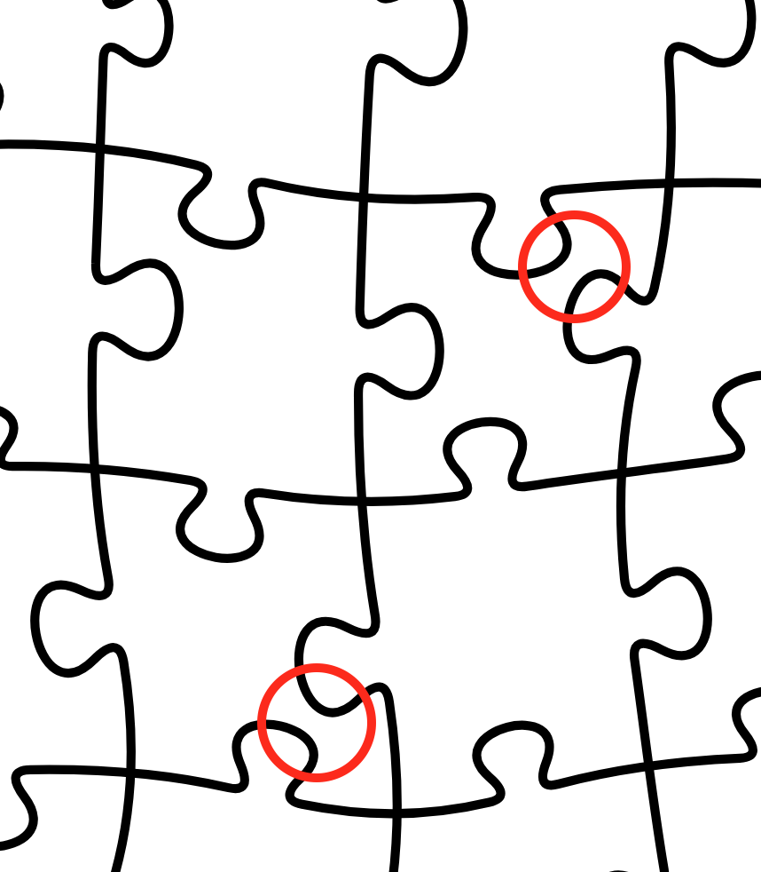

# Generador de rompecabezas

## Versión actual

El script ```PUZZLE.py``` genera un archivo ```PUZZLE.svg``` con líneas de corte.

Los parámetros de momento se ajustan dentro del script, por lo que hay que ajustarlos antes de correrlo.


### Parámetros

* ```ncols```: cantidad de columnas.
* ```nrows```: cantidad de filas.
* ```width```: ancho (sin unidad).
* ```height```: alto (sin unidad).
* ```err_max_h```,```err_max_v```: máximo desplazamiento de los vértices desde su posición original, tanto vertical como horizontal.
* ```coupling_width```: ancho del acople relativo al ancho de las aristas.
* ```coupling_slope_disp_factor```: factor de desplazamiento del acople según la pendiente de la arista.

### Bugs
Valores muy altos de ```err_max_h``` o ```err_max_v``` pueden hacer que los vértices terminen fuera de la cuadrícula, por lo que se dispara un error.

### Importante!
Ajustar ```coupling_slope_disp_factor``` para evitar que los acoples queden muy juntos con aristas inclinadas y las piezas resulten frágiles.



### Todo
- [ ] Cargar y/o almacenar los parámetros aleatorios generados para el rompecabezas actual.

- [x] Mejorar la generación de acoples para no producir piezas frágiles.
    
    - Pasos aplicados:
        
        $t$: ubicación del centro del acople

        $k$: ```coupling_slope_disp_factor```

        $m$: pendiente de la recta entre vértices
        
        $\Delta t = (m · k)^{1/3} · \left(1 - \frac{\text{coupling width}}{2}\right)$